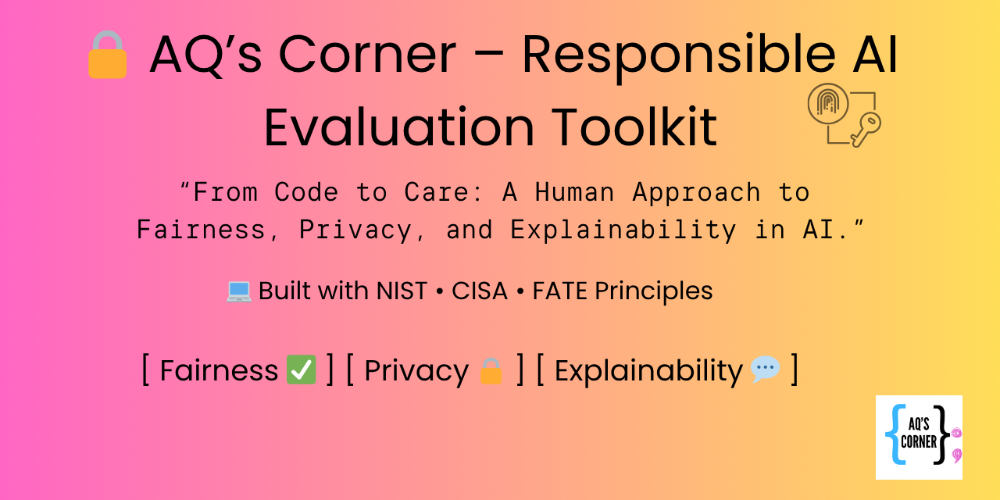

> 👋 Hi, I’m **Aqueelah Emanuel**, founder of **AQ’s Corner** — where motherhood meets cybersecurity and digital trust.  
> This open-source toolkit helps anyone evaluate AI systems for **Fairness, Privacy, and Explainability**, using plain-English checklists aligned to **NIST, CISA, and FATE**.

---

# AQ’s Corner – Responsible AI Evaluation Toolkit

>
> 1. **Use this as a template** → Create a new repo (suggested: `aqs-corner-responsible-ai-evaluation`)
> 2. **Add your first assessment** → Copy `templates/ai_tool_assessment.yaml` → `ai_assessments/<system>.yaml`
> 3. **Attach redacted proof** → Drop images/notes in `evidence/<system>/` (no confidential data)
> 4. **Run the checklist** → Open `templates/checklist.md` and check items off.
> 5. **Publish a summary** → Fill `templates/summary-report.md` and link it in **Assessment Summary** below.

> **Purpose:** A universal, copy-ready toolkit for evaluating any **AI system** — hiring platforms, chatbots, recommenders, content filters, or analytics tools — for *fairness, transparency, accountability, privacy, and safety*. Framework-aligned (NIST, CISA, FATE) and plain-language.

---

## ✨ How to Use This Package (5 steps)
1. Create your repo using this README.
2. Copy the `/templates` and `/.github` folders into your repo.
3. Fill out `ai_tool_assessment.yaml` (one file per AI system) and attach redacted evidence in `/evidence/<system>/`.
4. Work through `templates/checklist.md` and `templates/evaluation-plan.md`.
5. Publish findings: commit, push, and link your **Assessment Summary** here.

> 🔒 Keep proprietary data private. Use `/docs/redactions.md` to describe redacted material.

---

## 🧾 Assessment Summary (fill me in)
**System:** <name>  
**Scope:** AI model • recommender • chatbot • screening system  
**Findings:**
- Fairness: 

- Transparency: 

- Privacy/Security: 

- Accountability: 
  
**Outcome:** <key actions or improvements>

---

## 🧱 Core Frameworks (Plain-English Overview)
- **NIST Privacy Framework** – Treat privacy as risk to people; document what you collect and why.
- **CISA Secure by Design** – Secure defaults, reduce attack surface, disclose posture.
- **NIST SP 800-53 Rev.5** – PM/RA, AC/IA, SC/SI, AR/IP controls in practice.
- **FATE Principles** – Fairness, Accountability, Transparency, Explainability.

> 💡 Human Test: Can an average user understand how the system works — and correct it when it doesn’t?

---

## 📁 Repo Structure

.
├── README.md
├── templates/
│ ├── checklist.md
│ ├── evaluation-plan.md
│ ├── ai_tool_assessment.yaml
│ ├── model-card-lite.md
│ ├── privacy-notice-snippet.md
│ ├── risk-register.csv
│ └── summary-report.md
├── docs/
│ ├── examples.md
│ ├── redactions.md
│ └── glossary.md
├── evidence/
│ └── .keep
├── .github/
│ └── ISSUE_TEMPLATE/
│ ├── bias-issue.yml
│ ├── privacy-issue.yml
│ └── security-issue.yml
└── ai_assessments/
└── my-first-system.yaml (example)

---

## 🎨 Branding Notes (AQ’s Corner Style)
Palette: AQ Blue `#3ABAEB`, AQ Pink `#E967B8`, Ink `#151515`, Cloud `#F7FAFC`  
Tone: Plain-spoken, human-centered, encouraging — “We make the complex human.”  
Badges: `Fairness-Checked`, `Privacy-First`, `Explainability-Ready`

---

## 📚 Glossary (short)
- **Adverse impact**: Unintended harm to a specific group.
- **Explainability**: Why a result was produced.
- **Model card**: Short summary of model purpose/risks/limits.
- **Redaction**: Remove or mask sensitive details before publishing.

---

## 📝 License
MIT. Attribution to AQ’s Corner is appreciated when reused.

From **code to care**, that’s AQ’s Corner.

